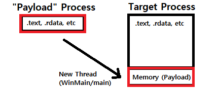
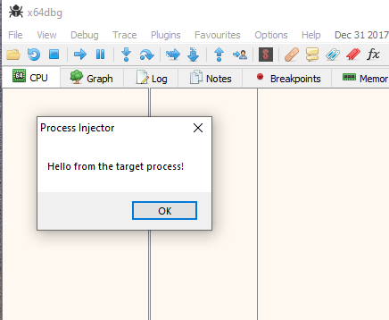

# Process Injection
Evasion & Injection Technique: Copies the current process into a target process and begins execution (Windows)  

This example shows how we can inject code (or a process) into another running process, which creates persistence, assists with evasion, and allows code injection.

Steps Taken:  
1. Open the target process and allocate space greater or equal to the payload's image size using `VirtualAllocEx`  
2. Take the address for our new allocated buffer and write over the NT Optional header's ImageBase member with this address  
3. Copy all bytes from payload image to a buffer, write it into the target process using `WriteProcessMemory` after calling `VirtualProtectEx`  
4. Calculate the offset to our image's `main` routine by subtracting the address of `main` from the payload's image base  
5. Use the `main` offset (added with step 1's address) with `CreateRemoteThread` to make a new thread in our target process and begin program flow  

WinAPI and functions loaded from libraries should be calculated at runtime using function pointers in our payload code. This is because addresses will likely change between processes for most libraries: MSVCR120.dll might be loaded at different addresses in different processes. In this example we're injecting a process into the 'x64dbg.exe' process, which can be seen in the second screencap below.

  
  

If you feel there's anything wrong or missing from this example, feel free to open an issue or pull request!
